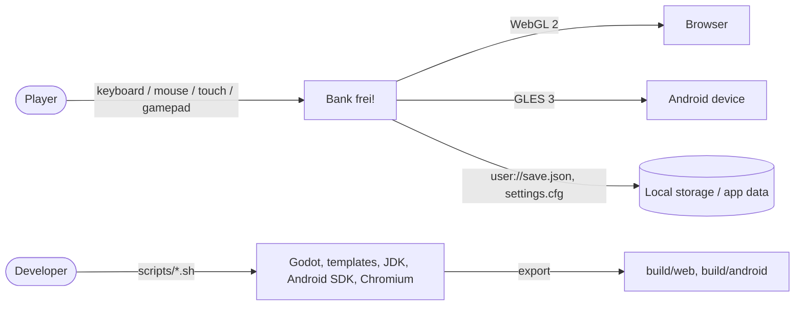
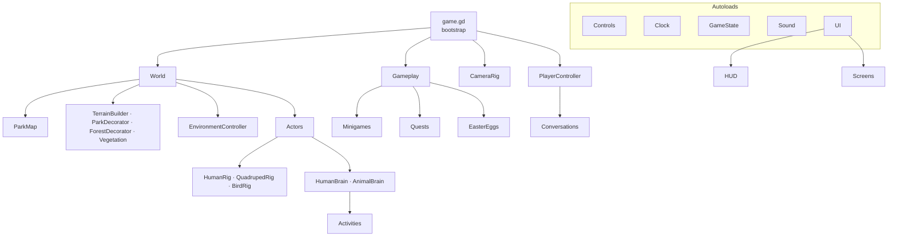
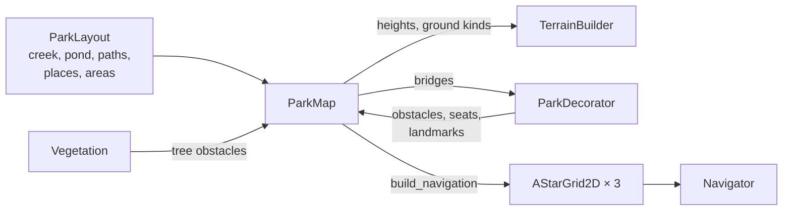
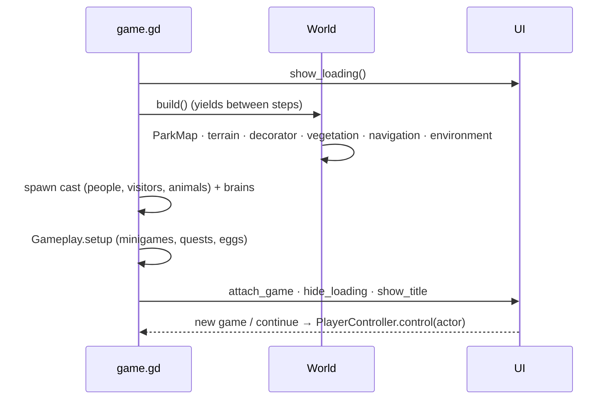
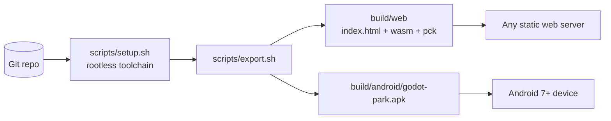

# Bank frei! – Architecture (arc42)

*Bank frei!* is a humorous open-world game set in a big city park. The player
controls one of ~70 people and animals, can switch to any character nearby and
lives a day in the park: eating, resting on benches, playing minigames, earning
money and discovering secrets. Everything that is not controlled by the player
lives its own life driven by needs and daily schedules.

UI language is German; code and documentation are English.

---

## 1. Introduction and goals

### 1.1 Requirements overview

| Area | Requirement |
|------|-------------|
| Platforms | Web (browser, WebGL 2) and Android, one code base (Godot 4.7) |
| World | Large park (260 × 180 m) with creek, pond with island, bridges, pavilion, fountain, playground, food court and food carts spread over the park, dog meadow, many benches, city skyline |
| Characters | Named people and animals with detailed, generated low-poly models; play any of them, switch to characters in range with a smooth camera transition |
| Life | Non-controlled characters follow needs (hunger, fatigue, joy), likes and schedules; good pathfinding |
| Needs | Very hungry or tired characters slow down; sad ones slump and emit sad smileys |
| Gameplay | 8 minigames, jobs/quests, money, achievements, easter eggs |
| Atmosphere | Day/night, weather, four seasons, procedural sound |

### 1.2 Quality goals

| Priority | Goal | Scenario |
|---|---|---|
| 1 | **Runs in the browser and on phones** | Web build starts without special server headers; a mid-range phone renders the park at playable frame rates |
| 2 | **Believable life** | Over a simulated day nobody is permanently stuck; people use paths, eat when hungry, go home in the evening |
| 3 | **Coherence** | One visual style (flat-shaded vertex colours), one data source for the park layout, one input model for all characters |
| 4 | **Testability** | Logic, scenario tests with real input for every feature, a scripted play-through and a reproducible simulation run headless; the web build is screenshot-tested |

### 1.3 Stakeholders

| Role | Expectation |
|---|---|
| Player | Fun, readable German UI, works with mouse/keyboard, touch and gamepad |
| Developer (repo owner) | Reproducible rootless toolchain, one-command build and test, understandable code |

---

## 2. Constraints

- **Godot 4.7, GDScript only**, *Compatibility* renderer (WebGL 2 / GLES 3) for web and Android.
- **No imported art assets**: all meshes, textures, icons and sounds are generated at runtime.
- **Rootless VPS**: toolchain (Godot, export templates, JDK 17, Android SDK, Chromium for tests) installs into
  `~/.local/opt/godot-park` without `sudo` (`scripts/setup.sh`).
- **Single-threaded web export** (`variant/thread_support=false`): no `SharedArrayBuffer`, no COOP/COEP headers needed.
- Android export uses the pre-built APK template (no Gradle/NDK), debug-signed.

---

## 3. Context and scope



The game has no network communication. Persistent data is the save game (JSON) and
settings (ConfigFile) in `user://` (IndexedDB on the web, app storage on Android).

---

## 4. Solution strategy

| Problem | Approach |
|---|---|
| No asset pipeline, small download | **Procedural everything**: `MeshKit` builds flat-shaded vertex-coloured meshes from primitives; characters are `Skeleton3D` + one rigidly skinned mesh; sounds are synthesised into `AudioStreamWAV` |
| Performance on web/phones | MultiMesh batching per chunk (`InstanceBatcher`), visibility ranges, one draw call per character, animation LOD, a pool of 6 lamp lights at night, quality presets |
| Coherent park | `ParkLayout` (static data) → `ParkMap` (derived grids: height, water distance, ground kind, obstacles) → everything else (meshes, navigation, placement) reads `ParkMap` |
| Pathfinding | `AStarGrid2D` on a 1 m grid with per-cell costs (paths cheap, grass expensive) + cost-aware string pulling; separate grids for humans, animals and swimmers |
| Living park | Utility AI for people (needs × likes × schedule × role routine), state machines for animals; activities are small reusable objects |
| Seasons/weather | Global shader uniforms (`season_tint`, `snow_amount`, `foliage_amount`, …) drive all materials; no mesh rebuilds |
| Testing | Headless unit tests, scripted smoke play-through, accelerated simulation with statistics, Playwright screenshots of the web export |

---

## 5. Building block view

### 5.1 Level 1



| Directory | Responsibility |
|---|---|
| `src/autoload/` | `Controls` (input map, touch mode), `Clock` (time, seasons, weather), `GameState` (money, stats, achievements, save/load, settings), `Sound` (synthesiser, ambient loops) |
| `src/core/` | `ParkLayout` (design data), `ParkMap` (derived grids, bridges, obstacles, nav grids), `Navigator` (path queries), `Cast` (all characters), `Achievements` |
| `src/models/` | `MeshKit`, `Materials`, `NatureModels` (trees, plants), `PropModels` (benches, landmarks, stands, city, items, easter-egg models) |
| `src/shaders/` | `solid`, `foliage`, `ground`, `water`, `glow`, `sky` + shared include |
| `src/world/` | `World` (build orchestration and registries), builders, `EnvironmentController`, `InstanceBatcher`, `MapImage`, `Projectile` |
| `src/actors/` | `Actor` (movement, sitting, items, leash), `Needs`, rigs and `RigBuilder`, `EmoteIcons` |
| `src/ai/` | `Brain`, `HumanBrain`, `AnimalBrain`, `Activity`, `Activities` |
| `src/interact/` | `Interactable`, `Seat`, `Bench`, `Shop`, `Food`, `Bottle`, `FunctionSpot`, `StashSpot` |
| `src/game/` | `game.gd`, `PlayerController`, `Conversations`, `Gameplay`, `Quests`, `QuestMarkers`, `EasterEggs`, `TaskBoard`, `DevOptions`; Nordwald: `Gathering`, `Crafting`, `DwarfQuests` |
| `src/minigames/` | `Minigame` base, `BallSim` and the eleven games (three in the Nordwald) |
| `src/ui/` | `UI` autoload, `Hud`, `TouchControls`, `MapScreen`, `TasksScreen`, `UiTheme` |
| `tests/` | Unit tests (`tests/unit`), scenario tests (`tests/scenarios`, `tests/scenario.gd`), smoke play-through, web screenshot script |

### 5.2 Park data pipeline



`ParkMap` computes on a 1 m grid (261 × 361 vertices: the city park from z = −90 to 90 and the
Nordwald from z = −270 to −90; `ParkMap.in_park` is the city park, `in_world` both):

- **water distance field**: rasterised per creek and brook segment (bounding boxes only) plus an ellipse distance for the two ponds and the island;
- **heights**: gentle hills + shore profile + levelled plazas;
- **ground kinds** (grass, path, gravel, sand, water, bank, plaza, trail, bridge, stepping stones, rock); first per cell, then areas, plazas and walk structures within their bounding boxes (a per-cell loop over all of them cost 1.3 s at this size);
- **bridges**: detected automatically where a path crosses the creek, spanning until the ground is level again across the whole deck width (creeks are crossed at an angle); the deck is flush with the ground at both ends;
- **obstacles**: flags per cell (bit 0 blocks people, bit 1 animals), added by decorator and vegetation;
- **path surfaces** (`TerrainBuilder`): smooth strips along each path (mitred at bends, round open ends, clipped exactly at bridge ends, curbs on main paths); the 1 m path cells under them are drawn as grass so no staircase shows at the edges;
- **surface patterns** (`src/shaders/surface.gdshader`): the game has no image textures; paths, curbs, plazas, sidewalks, streets, bridges and tree bark get procedural patterns in the shader (pavers, gravel, forest earth, curb joints, plaza stone rings, asphalt, planks, cobbles, masonry, bark), one MeshKit surface per pattern (`Materials.PATTERNS`). Path strips carry UV (u = metres along the path, v = metres from the middle) so pavers follow the path; round plazas carry the offset from their centre; bridges and trunks use their local coordinates; gravel, earth and asphalt use world XZ. The foliage shader adds leaf clusters or needles (`leaf_pattern`, on the unswayed position so it does not swim in the wind), the ground shader blade streaks and clover in the grass. Detail fades out by pixel footprint (`detail()`), so distant paths stay calm and cost little;
- **navigation**: three `AStarGrid2D`s (people: weighted to prefer paths; animals: uniform; swimmers: water only).

### 5.3 Characters

```mermaid
classDiagram
  class Actor {
    needs: Needs
    rig: Rig
    brain: Brain
    go_to() sit_on() stand_up()
    consume() play_anim() say()
  }
  Actor --> Needs
  Actor --> Rig
  Actor --> Brain
  Rig <|-- HumanRig
  Rig <|-- QuadrupedRig
  Rig <|-- BirdRig
  Brain <|-- HumanBrain
  Brain <|-- AnimalBrain
  HumanBrain --> Activity
  Activity <|-- Wander
  Activity <|-- Sit
  Activity <|-- Eat
  Activity <|-- Jog
  Activity <|-- Feed
  Activity <|-- Perform
  Activity <|-- Work
  Activity <|-- "… 12 more"
```

- **Rigs** build a `Skeleton3D` with identity rest rotations and one skinned mesh (rigid skinning,
  one bone per vertex). Animation is procedural: each frame the rig sets target rotations per bone
  for the requested state (walk cycle, sit, eat, phone, photo, dance, …) plus mood overlays (sad
  posture, tired slouch), and blends towards them. Faces have blinking eyes and happy/sad mouths.
- **Actor movement** is kinematic: waypoint following, grid collision with sliding, soft separation
  between nearby people and dogs, terrain/bridge/pier height, swimming for ducks.
- **HumanBrain** scores candidate activities: `need pressure × personal like × noise`, plus a role
  routine (vendor at the stand, performer at the pavilion, gardener, dog sitter, chess player) and
  the visiting schedule (people arrive through a gate and go home). Rain sends people to shelter.
- **AnimalBrain** is a per-species state machine (dogs on leash/off leash/fetch, cats stalking mice
  and climbing trees, mice hiding in holes, ducks swimming and following their mother, squirrels
  climbing and stealing donuts, pigeons flying off, heron fishing, night animals).

### 5.4 Gameplay

- `Minigame` base class: start/end, rewards (joy + money), camera takeover, HUD with power bar and
  touch buttons. Games: Boule, Minigolf (6 holes), Hütchenspiel, Frisbee (also playable as the dog),
  Foto-Auftrag (with a real viewport snapshot), Pfandjagd, Futterchaos, Tic-Tac-Toe (minimax AI).
- `Conversations`: talking to a character offers chat, petting, switching and options registered by
  minigames and quests.
- `Quests`: dog walking job, the mime stuck in his invisible box, the bridge troll's riddles.
- `QuestMarkers`: glowing rings (`quest_ring.gdshader`) near the player under quest givers with an
  open quest, unfound gnomes (gold) and minigames whose notebook goal is open (blue).
- `EasterEggs`: 7 hidden garden gnomes, wishing fountain, duck statue and the "quak" code, Nessie,
  UFO, Nussi's donut stash, bench plaques.
- `GameState` keeps stats and sets; achievements unlock automatically when a stat reaches its target.

---

## 6. Runtime view

### 6.1 Start-up



### 6.2 An NPC gets hungry

1. `Needs.update` raises hunger every frame (game minutes).
2. When idle, `HumanBrain._choose` scores `Eat` high (`(hunger/100)² × 6 × like`).
3. `Activities.Eat` walks to an **open** shop (vendor present and at the counter), waits, is served,
   then uses `Activities.Sit` to find a table or bench and plays the eat animation.
4. On finish `Food.apply` lowers hunger and raises joy; sometimes the visitor drops a deposit bottle.

### 6.3 Switching characters

`PlayerController.control(new)` resumes the old actor's brain, suspends the new one's, lets the
camera interpolate from the old focus to the new one (1.2 s ease) and records the character for the
"Verwandlungskünstler" achievement. Only characters within 25 m that are on screen can be chosen.

---

## 7. Deployment view



- Web: static files, single-threaded build, served by any HTTP server.
- Android: debug-signed APK (arm64-v8a, x86_64), landscape, immersive mode.
- Production: push to `main` → VPS webhook builds the `Dockerfile` (Godot headless export inside the
  build stage, nginx on port 3000) → https://godot-park.ironstrike.de. Other branches → previews.
- The same image serves the Android APK (`/download` page, `/bank-frei.apk`), built in the Docker
  build stage with a minimal Android SDK and signed with the committed `deploy/bank-frei.keystore`.

---

## 8. Cross-cutting concepts

### 8.1 Coordinates and units
Metres; `Vector2(x, z)` for ground positions, `+x` east, `+z` south. Yaw 0 faces `+z`
(`forward = (sin yaw, 0, cos yaw)`). Models face `+z`.

### 8.2 Rendering style
Flat shading through per-triangle normals; vertex colours are converted to linear at build time.
Materials are shared by surface name (`solid`, `foliage`, `evergreen`, `cherry`, `grass`, `flower`,
`glow`, `water`, `ground`, `character`). Global uniforms implement seasons (tint, falling foliage,
blossoms, snow, ice), wetness and night glow.

### 8.3 Time
`Clock`: one real second = one game minute (a day lasts 24 minutes), three days per season.
Needs, schedules, shop hours, night animals, Nessie and the UFO depend on it.

### 8.4 Input
`Controls` registers all actions at runtime (keyboard, gamepad). Touch mode switches on with the first
touch and shows the virtual joystick and buttons. Tap/click on the ground walks there (path-finding),
tap on a character talks to it. Dialog options are reachable with number keys.

### 8.5 Persistence
`GameState.save_game()` stores money, stats, sets, achievements, flags, controlled character, actor
needs/inventory and the clock as JSON every minute and on achievements; settings live separately.

### 8.6 Localisation
All user-facing strings are German string literals next to the code that uses them (no runtime
language switch is required). Glyphs are limited to what the default font supports.

### 8.7 Performance
Instanced vegetation per 60 m chunk with visibility ranges (grass 45 m), character meshes hidden
beyond 140 m and animated at 10 Hz beyond 45 m, small animals skip avoidance, a light pool for lamps,
quality presets (shadows, MSAA, 3D render scale).

### 8.8 Testing
| Level | Tool | What |
|---|---|---|
| Unit | `tests/test_runner.tscn` | park map, navigation, needs, achievements, tic-tac-toe AI, ball physics, clock, cast/rigs |
| Scenario | `scripts/scenario.sh` (`tests/scenarios/*.gd`, base `tests/scenario.gd`) | ~140 tests that play the game natively and headless with real input (actions, keys, clicks, touch taps, dialog choices) from defined start states; catalogue with status per feature in [test-scenarios.md](test-scenarios.md) |
| Integration | `--smoke=1` (`tests/smoke_test.gd`) | quick play-through of all minigames, switching, quests, save/load, night/winter (calls internal methods) |
| Simulation | `--stats=1 --speed=6 --seed=1` | half a day of park life, reproducible; fails on script errors, invariant violations (money, needs, positions, water, seats) or too many stuck walkers |
| Visual | `scripts/web_test.sh` | exports web, renders presets in headless Chromium (screenshots only, no input), checks console errors |

Native test runs use `--fixed-fps` (deterministic steps, faster than real time) and start Godot
through `scripts/godot.sh`, which caps its memory. Dev options `seed=N` (reproducible randomness)
and `save=<name>` (own, fresh save file) keep runs independent.
`scripts/test.sh` runs unit, scenario, smoke and simulation; `WEB=1 scripts/test.sh` adds the screenshots.

---

## 9. Architecture decisions

| # | Decision | Rationale | Consequence |
|---|---|---|---|
| 1 | Procedural models instead of imported assets | No asset pipeline, tiny download, consistent style, easy variants (seasons, duck hats) | Model code is long; visual tweaking needs code changes |
| 2 | Kinematic movement on a grid, no physics engine | Deterministic, cheap, works identically on web | Collisions are approximate (cell resolution 1 m) |
| 3 | `AStarGrid2D` with weighted cells + string pulling | Fast native A*, paths preferred naturally, no navmesh baking on the web | Smoothing must check clearance; cost-aware shortcuts |
| 4 | Utility AI + activity objects | Easy to add behaviours, readable "doing" text for the UI | Tuning weights is empirical (simulation stats help) |
| 5 | Skinned single-mesh characters | One draw call per character | Rigid skinning only (no deformation), fine for low-poly |
| 6 | Compatibility renderer, single-threaded web build | Runs everywhere, no special hosting headers | No SDFGI/volumetrics; effects implemented in simple shaders |
| 7 | UI built in code | Consistent theme, no hand-written scene files | No visual editing in the Godot editor |

---

## 10. Quality requirements

| Scenario | Measure |
|---|---|
| Half a day of simulated life (6× speed) | 0 script errors, < 50 stuck-walker events, most actors not sad/starving |
| Scripted play-through | All minigames start and finish, save/load restores money |
| Web start | Loading screen with progress; no console errors in headless Chromium |
| Phone | Touch controls usable, quality preset `medium` by default |

---

## 11. Risks and technical debt

| Risk | Mitigation / note |
|---|---|
| Web start-up time (park generation in GDScript, ~1–3 s) | Loading screen with progress; generation could be baked to resources later |
| Swiftshader-based tests don't show real GPU performance | Use FPS display (settings) on real devices |
| Achievement "Bankdrücker" relies on bench ids staying stable | Bench ids are generated deterministically (seeded RNG) |
| Many actors with avoidance in crowded spots | Separation only near the camera and for people/dogs |
| Android emulator (SwiftShader in Docker) renders nothing, even for an empty Godot project (shader uniform limit 261) | `scripts/android_test.sh` verifies install, start, world build, runtime stability; visuals must be checked on a real device |
| Generated audio buffers: the mixer reads one sample past the end | Fixed by padding every generated `AudioStreamWAV` (found as a SIGSEGV on Android) |
| No release keystore / Play Store AAB | Debug APK only; Gradle build would need NDK + Android source template |

---

## 12. Glossary

| Term | Meaning |
|---|---|
| Actor | Any person or animal in the park |
| Brain | Decision logic for a non-controlled actor |
| Activity | One behaviour unit of a person (walk somewhere and do something) |
| Rig | Generated skeleton + skinned mesh + procedural animation of an actor |
| ParkMap | Runtime grids derived from `ParkLayout` |
| Seat | A place to sit (bench, table, stool, swing, blanket) |
| Bank frei! | Working title, German for "bench free!" |
